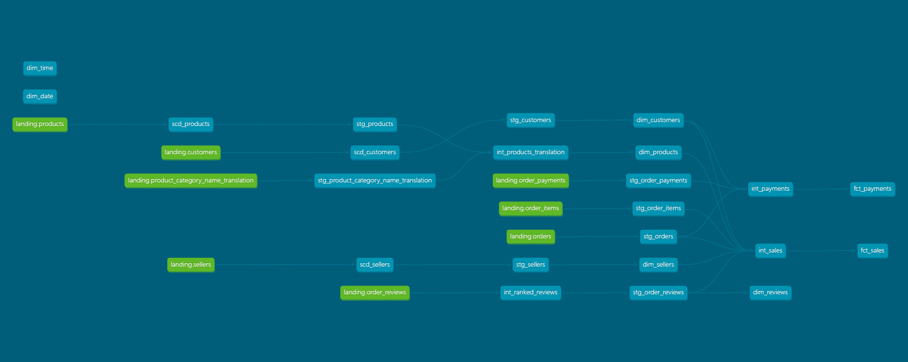
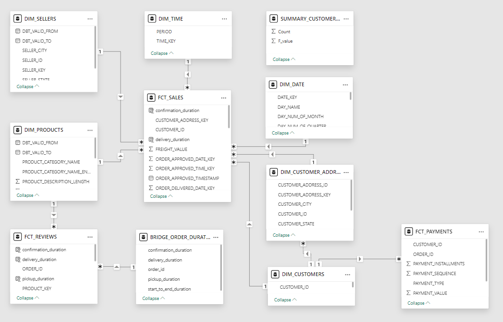

# Ecommerce Data Pipeline
This project showcases a robust data pipeline that automates the process of extraction, transformation, and loading (ETL) of transactional and operational data from an ecommerce platform. Leveraging a suite of modern data stack, the pipeline is designed to centralize data and prepare it for analysis, supporting informed decision-making and business insights.

## Table of Contents
- [Ecommerce Data Pipeline](#ecommerce-data-pipeline)
  - [Table of Contents](#table-of-contents)
  - [Architecture](#architecture)
  - [Project Structure](#project-structure)
  - [Data Source](#data-source)
  - [Quickstart](#quickstart)
    - [Clone the repository](#clone-the-repository)
    - [Setup virutal environment](#setup-virutal-environment)
    - [Start services](#start-services)
  - [Tech Stack](#tech-stack)
    - [Apache Airflow](#apache-airflow)
    - [Azure Data Lake](#azure-data-lake)
    - [Minio](#minio)
    - [DuckDB](#duckdb)
    - [Apache Spark](#apache-spark)
    - [Snowflake](#snowflake)
    - [PostgreSQL](#postgresql)
    - [dbt \& Great Expectations](#dbt--great-expectations)
    - [Slack](#slack)
    - [PowerBI](#powerbi)
  - [Business Insights](#business-insights)
    - [1. Master Dashboard](#1-master-dashboard)
      - [1.1. Sales Overview](#11-sales-overview)
      - [1.2. Highest Sales Date](#12-highest-sales-date)
      - [1.3. Customer Segmentation](#13-customer-segmentation)
    - [2. Customer Segments' Preferences](#2-customer-segments-preferences)
      - [2.1. "Inactive Customers" and "Recent Buyers"](#21-inactive-customers-and-recent-buyers)
      - [2.2. "VIP Shoppers" and "Past High Rollers"](#22-vip-shoppers-and-past-high-rollers)
    - [3. Product Reviews](#3-product-reviews)
    - [4. Delivery Time](#4-delivery-time)
    - [5. Recommendations](#5-recommendations)
      - [5.1. Consider peak sales time](#51-consider-peak-sales-time)
      - [5.2. Targeted marketing based on customer segments](#52-targeted-marketing-based-on-customer-segments)
      - [5.3. Products’ Quality Control](#53-products-quality-control)
      - [5.4. Address delivery issues](#54-address-delivery-issues)

## Architecture
<p align="center">
    
    </br>
  Project Dataflow
</p>

## Project Structure
```shell
.
├── airflow/              /* airflow folder, contains DAGs and scripts */
├── assets/               /* assets folder, contains various project assets: dashboard, images... */
├── dbt_ecom/             /* dbt project folder, contains dbt scripts */
├── docker/               /* docker folder, contains builds, configurations,... for related Docker services */
│   ├── airflow/               /* airflow orchestrator configurations */
│   ├── postgres/              /* postgres database initialization script */
│   ├── spark-app/             /* spark-app configurations, an app that submits jobs from an isolated container */
│   ├── spark-master/          /* spark-master configurations */
│   ├── spark-worker/          /* spark-worker configurations */
├── .gitignore
├── docker-compose.yaml   /* Docker Compose file to define services */
├── Makefile              /* Makefile for automating tasks and commands */
├── README.md
└── requirements.txt
```

## Data Source
Below is the relationships of our datasets, it was generated from the OLTP system of an ecommerce platform called <strong>Olist</strong>. Throughout the process, we will transform this into a viable data warehouse model sufficient for analytics workload.
<p align="center">
    
    </br>
  Source Relational Model
</p>


## Quickstart
> For optimal experience, ensure you have the following services installed before starting this project:
> - <strong>Git</strong>. Obviously.
> - <strong>Conda/Mamba</strong> for Python package management and virtual environment setup. This is optional, you can use python venv or uv venv (if you use uv), up to your preference, just make sure to create and use a virtual environment to separate this project's dependencies.
> - <strong>Docker</strong> for containerization. This is used for setting up certain services included in our project.
> - <strong>Makefile</strong> for automating Docker commands. This is also optional, if you don't want to use it, just use the original Docker syntax to manage your containers.

### Clone the repository
```shell
git clone https://github.com/cdoge25/ecommerce-data-pipeline.git
```

### Setup virutal environment
Navigate to your cloned directory
```shell
conda create -n <your_env_name> python=3.11
y
conda activate <your_env_name>
pip install -r requirements.txt
```

### Start services
> Pre requisites:
> - Before firing up the containers, make sure you create a .env file at the root level. This is for passing your desired environment variables into the containers (particularly your credentials). Please refer to the .env.example to have a grasp of what you should include. If you want to change or add additional variables in the .env file, you may need to adjust your `docker-compose.yaml` file accordingly to reflect the exact environment variables.
> - You should also pre-download jar files for spark and place them directly within each of spark-app, spark-master, spark-worker folder. Please refer to the Dockerfile of each services to know which jars to download. I have preconfigured the Dockerfiles to automatically copy the jar files to their respective location in the containers, given that you already downloaded the jar files. If you don't want to download the jar files to your local machine, you can comment out the `COPY` block of jar files and uncomment the `RUN` block to download the jar files to the containers instead. However, this would take up a considerable amount of time whenver you need to rebuild the containers because the download process need to be run again, therefore I recommend you to use the pre-download approach instead.
This command will download the docker images, build containers and start the declared services in the `docker-compose.yaml` file. About what each `make` command options do, refer to the Makefile for more information.
Now for a quick startup, run this command
```shell
make up
```
As stated before, this is wholy optional, if you don't use `Makefile` you can still start up your services with this command
```shell
docker compose up -d --build
```

## Tech Stack
### Apache Airflow
Our workflow orchestrator, responsible for managing and scheduling data pipelines
<p align="center">
    
    </br>
  Airflow overview
</p>

After initializing airflow containers, connect to either airflow-scheduler or airflow-webserver terminal and run this command:
```shell
bash create_connections.sh
```
This is a custom file to automate creating airflow hooks (connection strings and credentials for airflow). Our tasks would later use these configurations to link multiple services together. Modify it based on your credentials, the file is located at [docker/airflow/create_connections.sh](docker/airflow/create_connections.sh)

### Azure Data Lake
Cloud Storage Solution to store our data in its raw and processed state. This service requires you to have an Azure Subscription, with a pre-configured Storage Account for Azure Data Lake Gen 2. You can sign up for Azure Trial if you haven't done it already, it will give you access to Azure services for 30 days to practice your skills. If you don't have Azure available, please refer to the Minio section as a local alternative for this project.
<p align="center">
    
    </br>
  Azure overview
</p>

### Minio
This service serves as a local object storage if you don't have access to any of the cloud providers. It is configured to automatically run as a container when you use `make up`, If you already have another cloud storage option, consider comment out this service from `docker-compose.yaml` for less resource drain.
<p align="center">
    
    </br>
  Minio overview
</p>

### DuckDB
This is our data processing engine at the data lake layer. You can check it out here: [DuckDB](https://github.com/duckdb/duckdb)

Polars is another great option for this kind of work, I did not use it for this project but you can also have a look at it: [Polars](https://github.com/pola-rs/polars)

Both of these tools are amazingly fast for our data scale but I decided to use more SQL so `DuckDB` it is.

If you decided to embark on another project, consider using these because `pandas` would probably be too slow and `spark` would probably be overkill. Ultimately, the choice is yours.

It doesn't really have a UI, so I will probably include this image just because.
<p align="center">
    
    </br>
  DuckDB overview
</p>

### Apache Spark
Even though I said that Spark is overkill, I need to somehow include it to demonstrate my so called "modern tech-stack". So here we are, Spark serves as another layer of data processing before we can officially load it into our data warehouse. We will have a spark-master container which manages, spark-worker which runs our tasks, and spark-app which submits the tasks.
<p align="center">
    
    </br>
  Spark overview
</p>

At this point, spark-app isn't built yet so you have to run this command:
```shell
make spark-app
```
As the name suggests, our spark jobs are submitted from another container, which help ensures package dependencies for our main containers.

### Snowflake
Cloud Data Warehouse Solution, where we load our processed data from the Data Lake. This service also requires you to have a Snowflake Account, and it does have a 30 days trial for your first sign-up. If you don't have access to Snowflake, please refer to the PostgresSQL section as the local alternative for this project.
> For setting up Snowflake beforehand, refer to [snowflake-setup.md](snowflake-setup.md)
<p align="center">
    
    </br>
  Snowflake overview
</p>

### PostgreSQL
By default, when starting up our containers, PostgreSQL is used as the metadata database for Airflow. However (even though not recommended), we can utilize it as our local data warehouse.
<p align="center">
    
    </br>
  PostgreSQL overview
</p>

### dbt & Great Expectations
dbt serves as a tool for transforming our data into analytics-ready datasets by leveraging SQL-based models. It helps streamline our data cleaning and augmenting process in a consistent and efficient manner. It is the catalyst for building our final data model. Great-expectations acts as a data validation tool and is implemented directly into our dbt models.
<p align="center">
    
    </br>
  dbt overview
</p>

### Slack
Our notification channel for airflow dags, whether it succeeded or failed, we will be informed on our channel
> For setting up Slack Channel and Token, refer to [slack-setup.md](slack-setup.md)
<p align="center">
    
    </br>
  Slack overview
</p>

### PowerBI
This would serve as our visualization tool, using the data model that we have created so far.
<p align="center">
    
    </br>
  PowerBI overview
</p>

## Business Insights
Now that we have done all our data engineering work, it is time for some data analytics. The whole analytics is available as .pdf and .pbix located in the [assets/dashboard](assets/dashboard/) folder.
### 1. Master Dashboard
#### 1.1. Sales Overview

- The total sales, total orders are 13,59 million R$ and 99 thousand orders respectively, and have increased significantly since 2017, with the highest sales in 11/2017.
- The average order value is 137,75 R$.
- The cancellation rate is only 0,47%, which is a positive sign.
- The best selling products of all time are health and beauty products.
#### 1.2. Highest Sales Date

Drilling into 11/2017, it was obvious why this month yielded the greatest sales. Black Friday was the 24th of the month, orders and sales exploded during this day.
#### 1.3. Customer Segmentation

Customers are divided into 4 segments by using the RFM metrics. However, the datasets that were provided only consist of customers that either have made a purchase once or have never purchased anything, the F (Frequency) metric is therefore left out.
- 52 Customers are then segmented by using only the R (Recency) and M (Monetary) metrics.
- Those who have made a purchase recently that is also one of high-value are the “VIP Shoppers”, those who made a purchase of high-value but haven’t purchased again recently are the “Past High Rollers”. Those who ordered moderate-value products recently are the “Recent Buyers” and those who have only made a purchase of low-value products a long time ago are the “Inactive Customers”.
- Low to moderate-value customers are about 60% of the customer base but only account for 25% of sales .“VIP Shoppers” and “Past High Rollers” on the other hand, take about 40% of the customer base but account for 75% of sales, these are the customers that the company needs to focus more with their marketing efforts.
### 2. Customer Segments' Preferences

#### 2.1. "Inactive Customers" and "Recent Buyers"
These 2 types of customers are not so different on their taste and behavior, they share some common characteristics:
- They tend to make purchases during weekday afternoons.
- The value of their orders are not substantial so they want to pay up quickly,
preferably within 3 installments.
- They have a liking for items like bed-bath-table (which are home appliances),
health and beauty cosmetics, sports and leisure-related products
#### 2.2. "VIP Shoppers" and "Past High Rollers"
These 2 also have similar patterns in their favorite ordering time as the 2 types above as they prefer to make a purchase during weekday afternoons. VIP Shoppers especially are most active on Monday afternoons. Aside from that, these 2 types are alike in these traits:
- They love buying watches and gifts, apart from the common favorites.
- They tend to pay within 5 installments, probably because of the high value items.
The 4 segments are not separable by payment methods, as they all primarily pay with credit cards.
### 3. Product Reviews

Some statistics about product reviews:
- 40,77% of order reviews had a comment included.
- 77% of reviews were positive, which had a rating of either 4 or 5.
- cds-dvds-musicals had the highest average rating of 4,64 while security and services had the lowest average rating of 2,50.
### 4. Delivery Time

Delivery time statistics:
- The average confirmation time is 0,53 days, the average pickup time is 2,75
days, the average delivery time is 9,14 days. From start to end (purchasing to receiving),
the process took 12,41 days on average.
- 8,11% of orders were late.
One key takeaway is that the delivery time does affect the customers’
satisfaction: the slower the delivery time, the lower the review score. That’s why we
will need to look at specific sellers, cities or states that are having delivery problems.


States and cities that have a percentage of late orders over the average number would be marked with a red icon. Considering the top 3 states that generate the highest sales, we have RJ (Rio de Janeiro) quite out of standard so we would look at this state in specific to uncover the underlying issues.

Looking at the figure, almost all the cities in this state are having a problem with delivering orders on time. The sellers are obviously not at fault here since the confirmation time and pickup time was relatively short while the time to and deliver an order took ages to complete.
### 5. Recommendations
#### 5.1. Consider peak sales time
- Special days like Black Fridays or other holidays are a must for marketing strategies in order to increase product sales.
- Organize campaigns during weekday afternoons since this is the time that customers are active the most.
#### 5.2. Targeted marketing based on customer segments
For the “Inactive Customers” and “Recent Buyers” groups:
- Consider boosting marketing efforts on bed-bath-table, beauty cosmetics, sports and leisure-related products.
- Release vouchers that encourage installments in 3 months since this is their preferred duration to pay off an order.

For the “VIP Shoppers” and “Past High Rollers”:
- Focus more on these 2 groups than the previous 2 since they generate more sales.
- Consider boosting marketing efforts on watches and gifts, basically luxury items and beauty products.
- Release vouchers that encourage installments in 5 months since this is their preferred duration to pay off an order.

For “VIP Shoppers” specifically, consider releasing any kinds of vouchers or exclusive deals that would be in effect on Mondays as this is their favorite day to shop.
#### 5.3. Products’ Quality Control
Look into sellers who sell diapers and hygiene, security and services products to see why they are getting negative reviews. Try to resolve the problem by contacting the seller and enforce measures to check their products’ quality. There might be fraudulent activities going on with the sellers who sell these kinds of products.
#### 5.4. Address delivery issues
- A great number of states and cities were below standard in delivery time, especially Rio de Janeiro. This problem could lie in resource allocation. It seems that the company did not have enough warehouses or shipping units available in Rio de Janeiro, which led to a huge number of late deliveries.
- Perhaps they should consider searching for other transportation providers or have a direct meeting with the current partners to see what problems they encountered.
- If this issue could not be solved in a timely manner, consider providing customers that did not receive their package on time with compensation like vouchers or promotional offers.

---

<p>&copy; 2024 cdoge25 | Nguyen Duc Thien Hai</p>